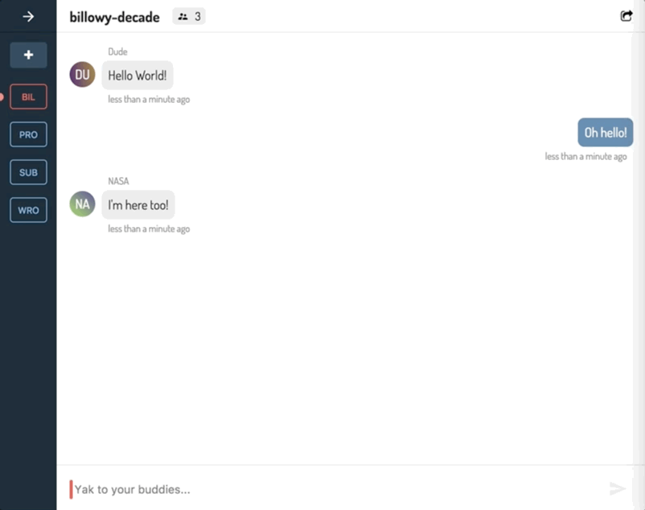
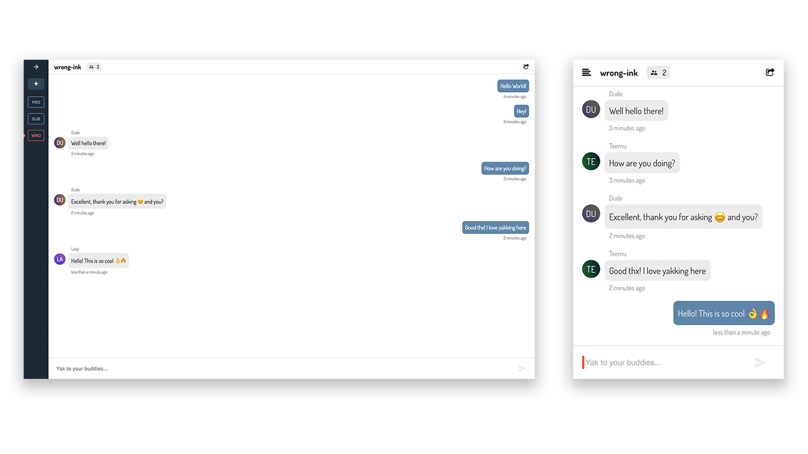
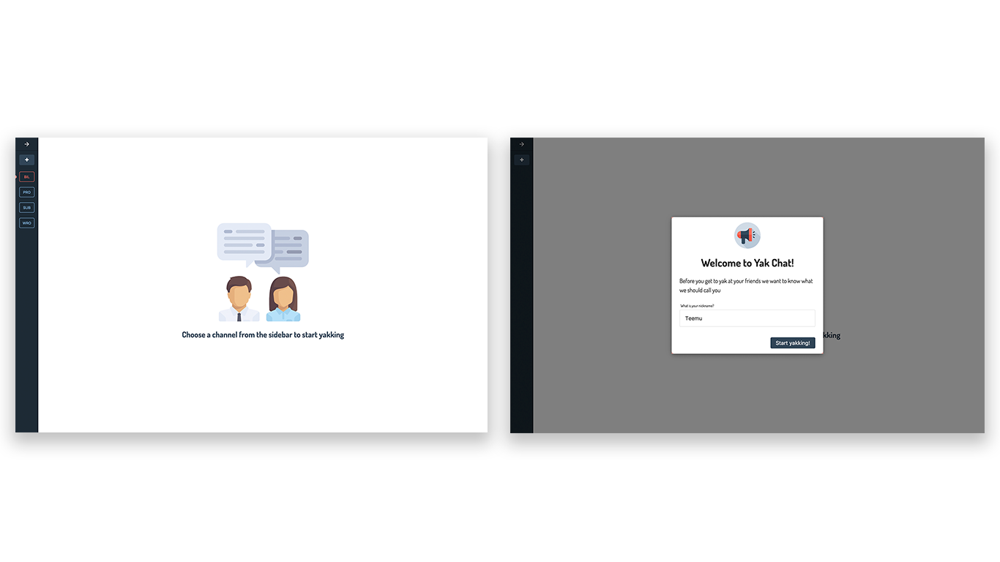
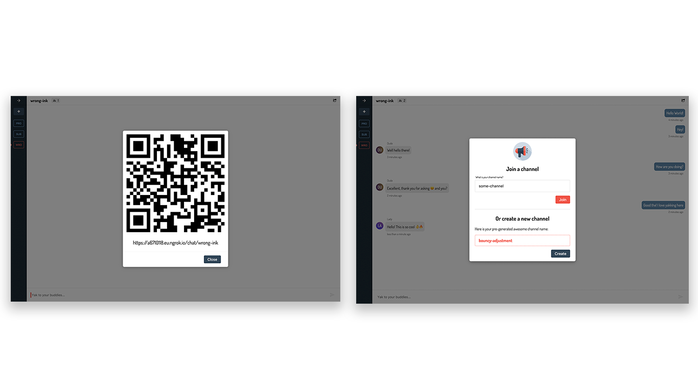

# Yak Chat

Yak Chat is a school project to research modern technologies such as WebSockets, Service Worker and offline storages to create an efficient and easy-to-use chat application.

The frontend is implemented with React, styled-components and mobx-state-tree, and the light-weight backend is built with Koa and MongoDB. Real-time communication is dealt with socket.io on both sides, and data is persisted with localStorage and the application caching is provided by create-react-app out of the box via a Service Worker.

---

<p align='center'>
  
<p/>

---

## Requirements

* [Docker](https://docs.docker.com/engine/installation/)
* [Node.js](https://nodejs.org/en/download/)
* [ngrok](https://ngrok.com/) (for production demo only)

## Development

First install linters:
```
$ npm install
```

Then start the app:
```
$ npm run up
```

Then open [localhost:3000](http://localhost:3000) in the browser.

## Production demo

Build the production demo version with ngrok:

First start ngrok:
```
$ ./ngrok http -region eu 3000
```

Then change the *API_URL* in `/client/src/config.js` to be the https url that ngrok outputs.

Then build the demo:
```
$ npm run demo
```

If you have made changes after last build re-build from scratch:
```
$ npm run demo:clean
```
### Handy commands

Remove current containers:
```
$ npm run down
```

Remove current containers and rebuild them:
```
$ npm run clean:build
```

Remove node_modules and install packages:
```
$ npm run clean:install
```

When you add a new npm package you need to reinstall packages inside the Docker
container:
```
$ npm run reinstall:client
$ npm run reinstall:server
```
## Screenshots

<p align='center'>
  
<p/>

<p align='center'>
  
<p/>

<p align='center'>
  
<p/>